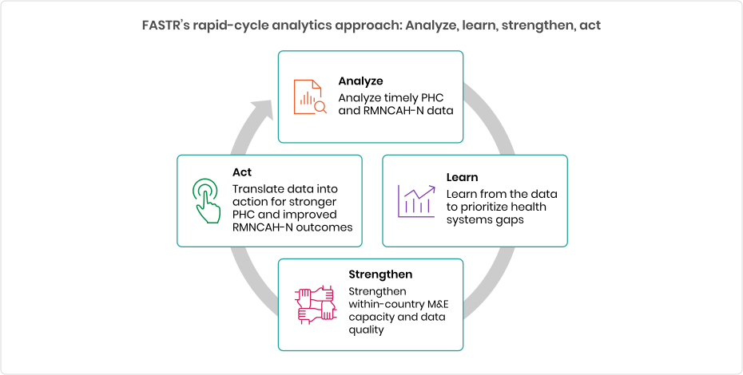

# Shared Assets

Images and assets used across workshop decks.

## Folder Structure

```
assets/
  logos/          ← FASTR logo, WHO logo, partner logos
  diagrams/       ← Methodology flowcharts, data flow diagrams
  screenshots/    ← DHIS2 screenshots, platform UI
  fastr-outputs/  ← Default FASTR visualizations (coverage charts, DQ heatmaps, etc.)
```

## Usage in Slides

From a workshop folder (workshops/*/):
```markdown


```

From core_content/ or templates/:
```markdown


```

Note: Currently available assets:
- diagrams/FASTR_rapid_cycle_analytics_approach.svg
- screenshots/hmis-csv-required-fields.png
