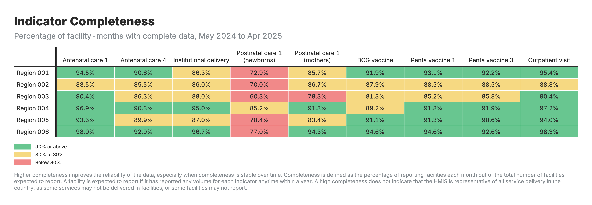
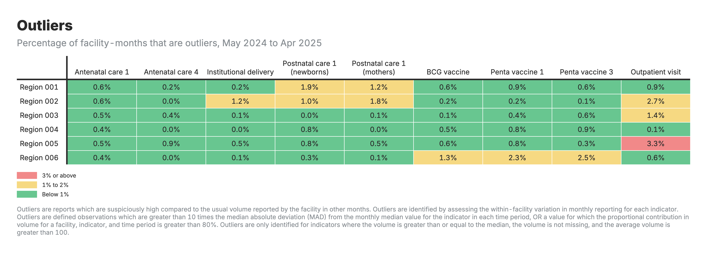
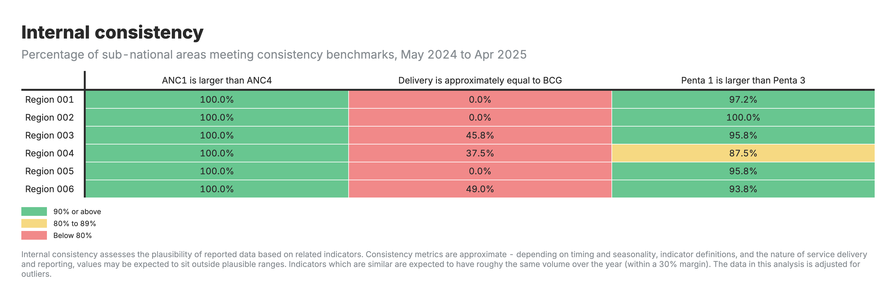
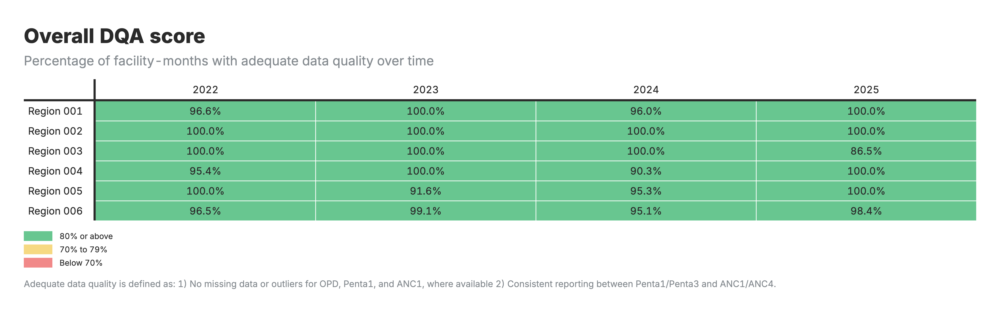
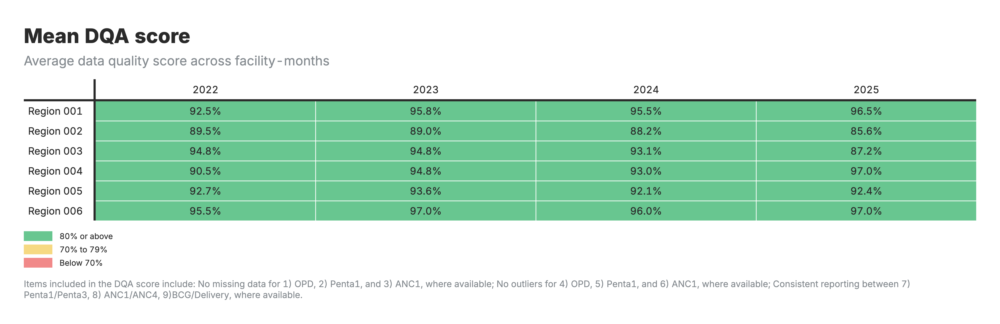

# Data Quality Assessment

Understanding the reliability of routine health data

---
## Why Talk About Data Quality?

**The challenge:** Health facilities report data every month, but sometimes:
- Numbers seem too high or too low
- Facilities forget to report
- Related numbers don't match up

**The impact:** Bad data leads to bad decisions
- We might think services are improving when they're not
- We might miss real problems in certain areas
- Resources might go to the wrong places

**FASTR's solution:** Check data quality systematically, fix what we can, and be transparent about limitations

---
## Three Simple Questions About Data Quality

**1. Are facilities reporting regularly?**
- Completeness: Did we get reports from facilities this month?

**2. Are the numbers reasonable?**
- Outliers: Are there any suspiciously high values?

**3. Do related numbers make sense together?**
- Consistency: Do related services show expected patterns?

These three questions help us understand if we can trust the data for decision-making.

---

## Question 1: Are Facilities Reporting?

---

## Completeness: Did We Get Reports?

**What we're checking:**
Each month, are facilities sending in their reports?

**Example:**
- District has 20 health centers
- In March, only 15 sent ANC data
- **Completeness = 75%** (15 out of 20 reported)

**Why it matters:**
- If many facilities don't report, we're missing part of the picture
- Trends might look like services dropped, when really facilities just didn't report

---

## What's Good Completeness?

**It depends on your health system:**
- 90%+ is excellent
- 80-90% is good
- Below 80% means we're missing a lot of information

**Important:** Even 100% completeness doesn't mean we have the full picture - some services might happen outside facilities or some facilities might not be in the reporting system.

**What to look for:** Is completeness improving over time? Which areas have low completeness?

---

## Completeness: FASTR Output

---

## Question 2: Are Numbers Reasonable?

---

## Outliers: Spotting Suspicious Numbers

**What we're checking:**
Are there any values that seem way too high compared to what that facility normally reports?

**Real example:**
- Health Center A normally reports 20-25 deliveries per month
- In March, they reported 450 deliveries
- **This is likely a data entry error** (maybe they typed an extra digit, or reported cumulative instead of monthly)

**Why it matters:**
- One extreme value can make it look like there was a huge service increase
- Skews totals and trends for the whole district or province

---

## How We Spot Outliers

**We use two checks:**

**Check 1: Is this value much higher than usual for this facility?**
- Look at the facility's typical monthly values
- If one month is extremely different, flag it

**Check 2: Does one month account for most of the year's total?**
- If March has 80% of the facility's annual deliveries, something's wrong
- Services should be spread more evenly across months

**Both checks together** help us find data entry errors or reporting problems.

---

## Outlier Example

**Health Center B - Malaria Tests:**

| Month | Tests Reported | Normal? |
|-------|----------------|---------|
| January | 245 | Normal |
| February | 267 | Normal |
| **March** | **2,890** | **Outlier** |
| April | 256 | Normal |

**What happened?** Probably someone entered "2890" instead of "289" (extra zero)

**Impact if we don't fix it:** March would show a huge "spike" in malaria that didn't really happen.

---

## Outliers: FASTR Output

---

## Question 3: Do Related Numbers Match Up?

---

## Consistency: Do Related Services Make Sense Together?

**What we're checking:**
Health services are related - certain patterns are expected.

**Example 1 - ANC visits:**
- More women should get their **1st** ANC visit (ANC1)
- Fewer should complete all **4** visits (ANC4)
- We expect: ANC1 >= ANC4

**Example 2 - Vaccinations:**
- More babies should get their **1st** Penta dose (Penta1)
- Fewer should complete all **3** doses (Penta3)
- We expect: Penta1 >= Penta3

**If these relationships are backwards, something's wrong with the data.**

---

## Why Check Consistency at District Level?

**Patients move between facilities:**
- Woman might get ANC1 at Health Center A
- But deliver at District Hospital B
- If we only look at each facility separately, numbers might not match

**Solution:** Check consistency at district level
- Add up all ANC1 visits in the district
- Add up all ANC4 visits in the district
- Compare the totals

This accounts for patients visiting different facilities for different services.

---

## Consistency Example

**District X - ANC Services:**

| Indicator | District Total | Expected Relationship |
|-----------|----------------|----------------------|
| ANC1 | 5,200 visits | Should be higher |
| ANC4 | 4,100 visits | Should be lower |

**This passes the consistency check** - more women started ANC (5,200) than completed 4 visits (4,100).

**If it was reversed** (more ANC4 than ANC1), we'd know there's a data quality problem.

---

## Consistency: FASTR Output

---

## Putting It All Together: Overall Data Quality

---

## Overall Quality Score

**For each facility and month, we combine all three checks:**

**Complete:** Did the facility report?
**No outliers:** Are the numbers reasonable?
**Consistent:** Do related numbers make sense?

**If all three pass -> Quality Score = 1 (good quality)**
**If any fail -> Quality Score = 0 (quality issue)**

**This score helps us:**
- Decide which data to use for analysis
- Identify facilities that need support
- Track if data quality is improving over time

---

## Overall DQA Score: FASTR Output

---

## Mean DQA Score: FASTR Output

---
