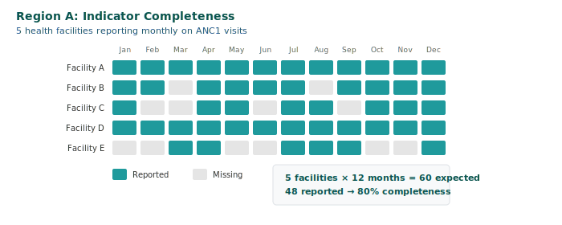

## Question 1: Are facilities reporting?

---

## Completeness: Did we get reports?

**What we're checking:**
Each month, are facilities sending in their reports?

**Why it matters:**
- Missing reports = incomplete picture
- Apparent drops may just be missing data

---

## What's good completeness?

**It depends on your health system:**
- 90%+ is excellent
- 80-90% is good
- Below 80% means we're missing a lot of information

**Important:** Even 100% completeness doesn't mean we have the full picture - some services might happen outside facilities or some facilities might not be in the reporting system.

**What to look for:** Is completeness improving over time? Which areas have low completeness?

---

## Completeness: FASTR output

